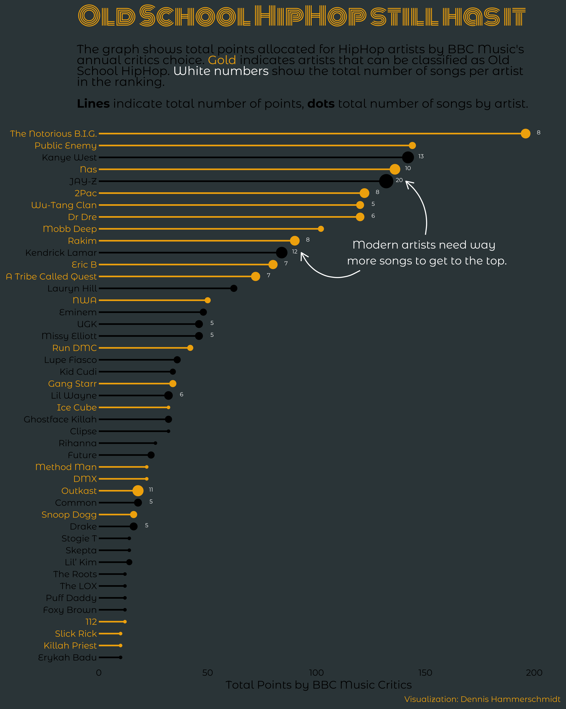

# TidyTuesday

---

:necktie: [LinkedIn][LinkedIn]&nbsp;&nbsp;|&nbsp;&nbsp;[:octocat: GitHub][GitHub]&nbsp;&nbsp;|&nbsp;&nbsp;:earth_africa: [Website][Website]

<!--
Quick Link 
-->

[LinkedIn]:https://www.linkedin.com/in/dennis-hammerschmidt/
[GitHub]:https://github.com/dennis-hammerschmidt/
[Website]:https://dennis-hammerschmidt.rbind.io/

This repo contains the code and showcases my contributions to #tidytuesday. Below is a quick outline of my past visualizations. The code for the corresponding week and visualization can be found in the respective folder in the repo.

## Volcanos

:point_right: **[Code](week20_2020/2020_W20_Volcano.R)** 

  

## GDPR Fines

:point_right: **[Code](week16_2020/2020_W17_GDPR.R)** 

  

## HipHop Artists

:point_right: **[Code](week16_2020/2020_W16_HipHop.R)** 

  

## Tour de France

:point_right: **[Code](week15_2020/2020_W15_TDF.R)** 

  

## US Beer Production

:point_right: **[Code](week14_2020/2020_W14_Beer.R)** 

  

## Traumatic Brain Injuries

:point_right: **[Code](week13_2020/2020_W13_TBI.Rmd)** 

  

## The Office

:point_right: **[Code](week12_2020/2020_W12_The_Office.R)** 

 
  

## US College Tuition Fees

:point_right: **[Code](week11_2020/2020_W11_Tuition_Data.R)** 

  

